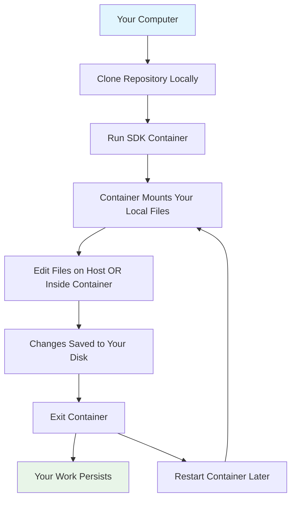
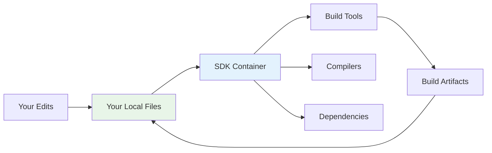
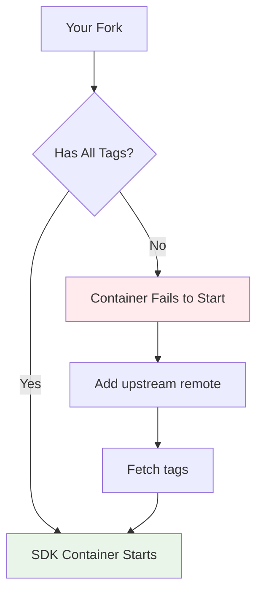
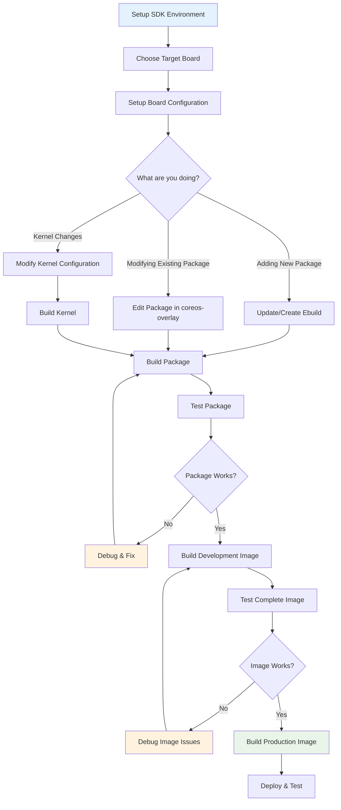
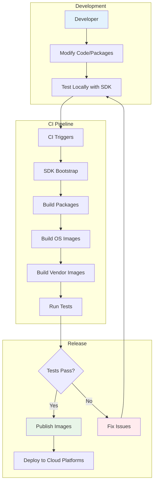

# Flatcar Container Linux SDK

<div style="text-align: center">

[![Flatcar OS](https://img.shields.io/badge/Flatcar-Website-blue?logo=data:image/svg+xml;base64,PD94bWwgdmVyc2lvbj0iMS4wIiBlbmNvZGluZz0idXRmLTgiPz4NCjwhLS0gR2VuZXJhdG9yOiBBZG9iZSBJbGx1c3RyYXRvciAyNi4wLjMsIFNWRyBFeHBvcnQgUGx1Zy1JbiAuIFNWRyBWZXJzaW9uOiA2LjAwIEJ1aWxkIDApICAtLT4NCjxzdmcgdmVyc2lvbj0iMS4wIiBpZD0ia2F0bWFuXzEiIHhtbG5zPSJodHRwOi8vd3d3LnczLm9yZy8yMDAwL3N2ZyIgeG1sbnM6eGxpbms9Imh0dHA6Ly93d3cudzMub3JnLzE5OTkveGxpbmsiIHg9IjBweCIgeT0iMHB4Ig0KCSB2aWV3Qm94PSIwIDAgODAwIDYwMCIgc3R5bGU9ImVuYWJsZS1iYWNrZ3JvdW5kOm5ldyAwIDAgODAwIDYwMDsiIHhtbDpzcGFjZT0icHJlc2VydmUiPg0KPHN0eWxlIHR5cGU9InRleHQvY3NzIj4NCgkuc3Qwe2ZpbGw6IzA5QkFDODt9DQo8L3N0eWxlPg0KPHBhdGggY2xhc3M9InN0MCIgZD0iTTQ0MCwxODIuOGgtMTUuOXYxNS45SDQ0MFYxODIuOHoiLz4NCjxwYXRoIGNsYXNzPSJzdDAiIGQ9Ik00MDAuNSwzMTcuOWgtMzEuOXYxNS45aDMxLjlWMzE3Ljl6Ii8+DQo8cGF0aCBjbGFzcz0ic3QwIiBkPSJNNTQzLjgsMzE3LjlINTEydjE1LjloMzEuOVYzMTcuOXoiLz4NCjxwYXRoIGNsYXNzPSJzdDAiIGQ9Ik02NTUuMiw0MjAuOXYtOTUuNGgtMTUuOXY5NS40aC0xNS45VjI2MmgtMzEuOVYxMzQuOEgyMDkuNFYyNjJoLTMxLjl2MTU5aC0xNS45di05NS40aC0xNnY5NS40aC0xNS45djMxLjINCgloMzEuOXYxNS44aDQ3Ljh2LTE1LjhoMTUuOXYxNS44SDI3M3YtMTUuOGgyNTQuOHYxNS44aDQ3Ljh2LTE1LjhoMTUuOXYxNS44aDQ3Ljh2LTE1LjhoMzEuOXYtMzEuMkg2NTUuMnogTTQ4Ny44LDE1MWg3OS42djMxLjgNCgloLTIzLjZ2NjMuNkg1MTJ2LTYzLjZoLTI0LjJMNDg3LjgsMTUxTDQ4Ny44LDE1MXogTTIzMywyMTQuNlYxNTFoNjMuN3YyMy41aC0zMS45djE1LjhoMzEuOXYyNC4yaC0zMS45djMxLjhIMjMzVjIxNC42eiBNMzA1LDMxNy45DQoJdjE1LjhoLTQ3Ljh2MzEuOEgzMDV2NDcuN2gtOTUuNVYyODYuMUgzMDVMMzA1LDMxNy45eiBNMzEyLjYsMjQ2LjRWMTUxaDMxLjl2NjMuNmgzMS45djMxLjhMMzEyLjYsMjQ2LjRMMzEyLjYsMjQ2LjRMMzEyLjYsMjQ2LjR6DQoJIE00NDguMywzMTcuOXY5NS40aC00Ny44di00Ny43aC0zMS45djQ3LjdoLTQ3LjhWMzAyaDE1Ljl2LTE1LjhoOTUuNVYzMDJoMTUuOUw0NDguMywzMTcuOXogTTQ0MCwyNDYuNHYtMzEuOGgtMTUuOXYzMS44aC0zMS45DQoJdi03OS41aDE1Ljl2LTE1LjhoNDcuOHYxNS44aDE1Ljl2NzkuNUg0NDB6IE01OTEuNiwzMTcuOXY0Ny43aC0xNS45djE1LjhoMTUuOXYzMS44aC00Ny44di0zMS43SDUyOHYtMTUuOGgtMTUuOXY0Ny43aC00Ny44VjI4Ni4xDQoJaDEyNy4zVjMxNy45eiIvPg0KPC9zdmc+DQo=)](https://www.flatcar.org/)
[](https://app.element.io/#/room/#flatcar:matrix.org)
[](https://kubernetes.slack.com/archives/C03GQ8B5XNJ)
[](https://x.com/flatcar)
[](https://hachyderm.io/@flatcar)
[](https://bsky.app/profile/flatcar.org)

</div>

## Table of Contents

- [What is this?](#what-is-this)
- [What can you do?](#what-can-you-do-with-the-sdk)
- [Quick Start](#-quick-start)
- [Repository Structure](#️-repository-structure)
- [Getting Started with SDK Container](#-getting-started-with-the-sdk-container)
  - [Standalone Mode (Experimentation)](#-standalone-mode-for-experimentation)
  - [Integrated Mode (Development)](#-integrated-mode-recommended-for-development)
- [Working with Packages and Ebuilds](#-working-with-packages-and-ebuilds)
- [Advanced Usage](#️-advanced-usage)
- [Getting Help](#-getting-help)
- [Contributing](#-contributing)

## What is this?

This repository contains the **Software Development Kit (SDK)** for building and customizing **Flatcar Container Linux** - a container-optimized Linux distribution designed for modern infrastructure.

Think of this as the "factory" where Flatcar OS images are built. Whether you want to modify the operating system, add custom packages, or build images for different cloud platforms, this is your starting point.

## What can you do with the SDK?

### What is an SDK and why do you need it?

A **Software Development Kit (SDK)** is a complete development environment that provides all the tools, libraries, and dependencies needed to build software for a specific platform. Think of it as a "toolbox" that contains everything required to create or modify Flatcar Container Linux.

**Why is an SDK needed for OS development?**

- **Cross-compilation**: Build software for different architectures (ARM64, AMD64) from any host system
- **Dependency management**: Ensures all build tools and libraries are at the correct versions
- **Reproducible builds**: Everyone uses the same environment, eliminating "works on my machine" issues
- **Isolation**: Keeps the complex build environment separate from your host system
- **Complexity handling**: OS building involves toolchains, kernel compilation, package management, and image creation

**What does this give you as a developer?**

- **Zero setup friction**: No need to install dozens of build tools and dependencies on your host
- **Consistent environment**: Same tools and versions as the Flatcar team uses
- **Complete control**: Modify any aspect of the operating system, from kernel to applications
- **Professional workflow**: Access to the same build pipeline used for official Flatcar releases

### Specific capabilities

- **Customize the OS**: Add, remove, or update applications and libraries using Gentoo Portage
- **Modify the kernel**: Change kernel configuration, add drivers, and manage kernel modules
- **Build images**: Create OS images for different deployment targets like _Cloud platforms_, _Bare metal servers_, _Virtual machines_, etc.
- **Develop packages**: Create and maintain software packages using ebuilds (Gentoo's package format)
- **SDK maintenance**: Upgrade SDK packages, update toolchains, and build new SDK versions

## 📚 Quick Start

**Just want to get started quickly?** Jump to [Getting Started with the SDK Container](#-getting-started-with-the-sdk-container) below.

**Need detailed guidance?** Check out our comprehensive documentation:
**[Flatcar Developer Guide][flatcar-docs]**

**First time here?** We recommend the [Integrated Mode](#-integrated-mode-recommended-for-development) for the best development experience.

[flatcar-docs]: https://www.flatcar.org/docs/latest/reference/developer-guides/sdk-modifying-flatcar/

## 🏗️ Repository Structure

This repository is organized into several key areas:

### Package Sources & Packaging System

Flatcar uses **Gentoo Portage**, a source-based package management system. Packages are defined by **ebuilds** (shell scripts that tell Portage how to build and install software).

All Flatcar packages come from two main repositories:

```
scripts/
└── sdk_container/
    └── src/
        └── third_party/
            ├── coreos-overlay/     <-- Flatcar-specific packages & ebuilds
            └── portage-stable/     <-- Standard Gentoo packages & ebuilds
```

#### How the Two-Tier System Works

- **`portage-stable`**: Contains unmodified packages and ebuilds from upstream Gentoo Linux
  - Synchronized from [gentoo/gentoo](https://github.com/gentoo/gentoo) repository
  - Updated using `./update_ebuilds` script when pulling in new/updated packages
  - Provides the foundational software stack (gcc, glibc, kernel, etc.)

- **`coreos-overlay`**: Contains Flatcar-specific modifications and custom packages
  - **Custom ebuilds**: New packages not in Gentoo (like `coreos-base/coreos`)
  - **Modified ebuilds**: Gentoo packages with Flatcar-specific patches or configuration
  - **Portage profiles**: Define build settings, USE flags, and package selections for different targets

#### Key Packaging Concepts

- **Ebuilds**: Recipe files (`.ebuild`) that define how to compile and install packages
- **Portage Profiles**: Configuration that determines build settings and default packages
- **Metapackages**: Special packages that depend on other packages to define complete system configurations
  - Example: `coreos-base/coreos-0.0.1.ebuild` defines the complete Flatcar production image contents
- **Board Targets**: Architecture-specific configurations (amd64-usr, arm64-usr)
- **USE Flags**: Compile-time options that enable/disable features in packages

### Important Directories

- **`ci-automation/`**: Scripts for continuous integration and automated builds
- **`build_library/`**: Core build utilities and helper functions  
- **`sdk_lib/`**: SDK container management and utilities
- **`oem/`**: Platform-specific configurations (AWS, Azure, etc.)

### Working with Git Tags

Flatcar uses Git tags extensively for version management. To keep your local repository up-to-date:

```bash
# Update all tags and remove deleted ones
git pull --all --tags --prune --prune-tags

# Force update tags if they've been re-tagged upstream
git pull --all --tags --prune --prune-tags --force
```

> **Note**: `git pull` and `git fetch` don't automatically sync tags, so run these commands regularly.

## 🐳 Getting Started with the SDK Container

The easiest way to work with Flatcar is using our pre-built SDK containers. No need to build anything from scratch!

**🔗 SDK Containers**: <https://github.com/orgs/flatcar/packages>

### Step 1: Choose Your SDK Flavor

| Container Type | Architecture Support | Size | Best For |
|----------------|---------------------|------|----------|
| `flatcar-sdk-all` | AMD64 + ARM64 | ~8GB (~3GB compressed) | **Most users** - Full development |
| `flatcar-sdk-amd64` | AMD64 only | ~6GB (~2GB compressed) | AMD64-only development |
| `flatcar-sdk-arm64` | ARM64 only | ~6GB (~2GB compressed) | ARM64 cross-compilation |

### Step 2: Choose Your Development Mode

Think of these as two different ways to use the SDK, each solving different problems:

| Mode | Best For | What It Does | Trade-offs |
|------|----------|--------------|------------|
| **🧪 Standalone** | Quick experiments, learning | Everything runs inside a throwaway container | ✅ Super simple setup<br>❌ Work disappears when container stops |
| **🚀 Integrated** | Real development work | Container + your local files work together | ✅ Work persists, use your favorite editor<br>❌ Requires cloning the repo |

### 🧪 Standalone Mode (For Experimentation)

**What is this?** A completely self-contained environment that you can spin up, experiment with, and then throw away. Perfect for learning or testing ideas without cluttering your system.

**How it works:** Everything happens inside the container - the SDK tools, the source code, your changes. When you exit, it's all gone (unless you explicitly save something).

**The Standalone Workflow:**
```
Your Computer → Pull SDK Container → Start Container → Download Source → 
Experiment & Build → Exit Container → 🗑️ Everything Disappears
```

> 💡 **Perfect for:** Learning, quick tests, trying ideas without commitment

#### Prerequisites

- **Docker**: The container runtime (like a lightweight VM system)
- **Internet**: To download the ~3GB SDK container and source code

#### Step-by-Step Walkthrough

**1. Get the SDK container (one-time download):**

```bash
# Why: This downloads the entire Flatcar build environment as a container image
# What: ~3GB download with all compilers, tools, and dependencies pre-installed
docker pull ghcr.io/flatcar/flatcar-sdk-all:4487.0.0
```

**2. Start your development environment:**

```bash
# For most development (packages, configs, etc.)
docker run -ti ghcr.io/flatcar/flatcar-sdk-all:4487.0.0

# For building complete OS images (needs more permissions)
docker run -ti --privileged -v /dev:/dev ghcr.io/flatcar/flatcar-sdk-all:4487.0.0
```

> **Why the difference?** OS image building needs to create disk partitions and filesystems, which requires special Linux permissions (`--privileged`) and access to device files (`/dev`).

**3. Set up the source code (inside the container):**

```bash
# Why: This downloads the actual Flatcar source code and scripts
# What: Clones the repository and sets up the build environment
sdk@container:~/trunk/src/scripts$ ../sdk_init_selfcontained.sh
```

**4. Start experimenting:**

```bash
# Now you can build packages, modify configurations, etc.
# Everything happens inside this container environment
sdk@container:~/trunk/src/scripts$ ./build_packages --help
```

**What happens when you exit?** The container stops and all your changes are lost. This is perfect for experimentation because you can't accidentally break anything on your host system.

### 🚀 Integrated Mode (Recommended for Development)

**What is this?** The best of both worlds - you get the powerful SDK environment, but your files live on your computer where you can edit them with your favorite tools (VS Code, vim, etc.). Your work persists between sessions.

**How it works:** The SDK container runs with your local repository "mounted" inside it. Changes you make are saved to your local disk, not lost when the container stops.



**Why is this better for real work?**

- 🎯 **Use your favorite editor**: Edit files with VS Code, vim, or whatever you prefer
- 💾 **Work persists**: Your changes are saved to your computer, not lost when container stops
- 🔄 **Resume anytime**: Stop and start containers without losing progress
- 🛠️ **Professional workflow**: Same setup the Flatcar team uses

#### Prerequisites

- **Git**: To clone and manage the repository
- **Docker**: To run the SDK container
- **10GB+ disk space**: For the repository, container, and build artifacts
- **Internet**: For initial downloads

#### Step-by-Step Walkthrough

**1. Get the source code on your computer:**

```bash
# Why: This puts the Flatcar source code on YOUR computer, not just in a container
# What: Downloads ~2GB of source code, build scripts, and git history
git clone https://github.com/flatcar/scripts.git
cd scripts

# Optional: Work with a specific release instead of the latest development version
git tag -l "alpha-*" | tail -5    # Show recent released versions
git checkout alpha-4487.0.0       # Switch to a stable release
```

**2. Start the integrated development environment:**

```bash
# Why: This starts an SDK container that can see and modify your local files
# What: Downloads SDK container (if needed) and connects it to your local repository
./run_sdk_container -t

# Alternative: Run a single command instead of interactive session
./run_sdk_container ./build_packages --help
```

**3. Understanding what just happened automatically:**



Behind the scenes, the script:

- ✅ **Downloads SDK container**: Gets the matching container version for your code
- ✅ **Mounts your files**: Your local `scripts/` folder becomes available inside the container
- ✅ **Sets up environment**: Configures paths, variables, and build settings
- ✅ **Preserves state**: Creates a persistent container that remembers your session

**4. Now you're ready for real development:**

```bash
# Inside the container - you now have access to all the build tools:
sdk@sdk-container:~/trunk/src/scripts$ ./build_packages     # Build OS packages
sdk@sdk-container:~/trunk/src/scripts$ ./build_image        # Build OS images
sdk@sdk-container:~/trunk/src/scripts$ ./setup_board        # Set up target architecture
```

**The magic:** You can edit files on your host computer (with VS Code, etc.) and immediately use those changes inside the container. No copying files back and forth!

#### Managing Your Development Environment

**Understanding containers vs sessions:**
Think of the SDK container like a virtual machine that remembers your workspace. Each time you run `./run_sdk_container`, it either:

- Reuses your existing container (preserving your previous work)
- Creates a new one if this is your first time

```bash
# See what containers you have
docker container ls --all

# Start fresh (removes your current container and all its state)
docker container rm <container-name>

# Use multiple parallel environments
./run_sdk_container -n my-experimental-work -t
./run_sdk_container -n my-stable-work -t
```

#### 🍴 Working with GitHub Forks

If you're contributing to Flatcar or maintaining your own fork, there's a crucial setup step:

**The Problem:** Flatcar's build system uses Git tags to determine version numbers. If your fork doesn't have the right tags, the SDK container will refuse to start.

**The Solution:**

1. **Fork ALL branches** (not just `main`) when creating your GitHub fork
2. **Sync tags** from the upstream repository:

   ```bash
   # Add the official repository as a remote
   git remote add upstream https://github.com/flatcar/scripts.git
   
   # Download all the version tags
   git fetch --tags upstream
   ```

**Why does this matter?** The SDK container looks at your current Git commit and figures out what version of Flatcar you're building. Without proper tags, it can't determine the version and will fail to start.



#### Troubleshooting Common Issues

| Problem | What's Happening | Solution |
|---------|------------------|----------|
| **"No release branch" error** | Your git repository is missing version tags | `git remote add upstream https://github.com/flatcar/scripts.git && git fetch --tags upstream` |
| **Container won't start** | Docker is confused or has conflicting containers | `docker system prune` then try again |
| **Out of disk space** | Build artifacts and containers are taking up space | `docker system prune -a` (warning: removes all unused containers/images) |
| **Permission errors** | Docker daemon isn't accessible to your user | Check `docker run hello-world` works, or add yourself to docker group |
| **Build takes forever** | First builds download and compile everything | Use `--getbinpkg` to download prebuilt packages when available |
| **Network timeouts** | Firewall blocking container networking | Temporarily disable firewall or configure Docker bridge networking |
| **"Package masked" errors** | Package conflicts with profile settings | Check `package.mask` files in profiles or adjust USE flags |
| **Cross-compilation failures** | Package doesn't support target architecture | Add architecture-specific patches in coreos-overlay |

#### Performance Tips

**Speed up builds:**

```bash
# Use binary packages when available (much faster)
./build_packages --board amd64-usr --getbinpkg

# Parallel builds (adjust -j based on your CPU cores)
export MAKEOPTS="-j8"

# Use ccache for faster rebuilds
export FEATURES="ccache"
```

**Reduce disk usage:**

```bash
# Clean build artifacts regularly
./build_packages --board amd64-usr --cleanbuild

# Remove old SDK containers
docker system prune --volumes

# Use specific architecture SDK to save space
docker pull ghcr.io/flatcar/flatcar-sdk-amd64:4487.0.0  # Instead of -all
```

**Debug build issues:**

```bash
# Verbose build output
./build_packages --board amd64-usr --verbose sys-apps/systemd

# Keep build logs
export PORTAGE_LOGDIR="/tmp/portage-logs"

# Build single package with debug info
PORTAGE_DEBUG=1 ./build_packages --board amd64-usr sys-apps/systemd
```

#### Advanced Container Options

Once you're comfortable with the basics, you can customize your setup:

```bash
# Use a different SDK version than what git thinks you need
./run_sdk_container -C ghcr.io/flatcar/flatcar-sdk-all:4459.0.0

# Mount additional directories into the container
./run_sdk_container -m /home/user/my-patches:/extra-files

# Create multiple named environments for different projects
./run_sdk_container -n flatcar-main -t          # For main branch work
./run_sdk_container -n flatcar-experiment -t    # For experimental features

# See all available options
./run_sdk_container -h
```

## 📦 Working with Packages and Ebuilds

### Understanding the Package System

Flatcar uses [**Gentoo Portage**](https://wiki.gentoo.org/wiki/Portage) with [ebuilds](https://wiki.gentoo.org/wiki/Ebuild) to define how software is built and installed. Here's how to work with the packaging system:

### Common Package Management Tasks

#### Adding or Updating Packages from Gentoo

```bash
# Update a single package from upstream Gentoo
./update_ebuilds sys-apps/systemd

# Update multiple packages
./update_ebuilds sys-apps/systemd app-containers/docker dev-lang/go

# Update entire categories (use with caution)
./update_ebuilds sys-kernel/
```

#### Building and Testing Packages

```bash
# Set up development environment for a board (required first step)
./setup_board --board amd64-usr

# Build specific packages for testing
./build_packages --board amd64-usr sys-apps/systemd

# Build all packages for an image
./build_packages --board amd64-usr

# Install built packages into the development image
./build_image --board amd64-usr dev
```

#### Creating Custom Packages

1. **Add an ebuild to coreos-overlay**:

```bash
# Create package directory
mkdir -p sdk_container/src/third_party/coreos-overlay/category-name/package-name

# Create the ebuild file
touch sdk_container/src/third_party/coreos-overlay/category-name/package-name/package-name-1.0.0.ebuild
```

2. **Basic ebuild structure**:

```bash
# Copyright notice and license
EAPI=8

DESCRIPTION="Description of your package"
HOMEPAGE="https://example.com"
SRC_URI="https://example.com/release.tar.gz"

LICENSE="Apache-2.0"  # or appropriate license
SLOT="0"
KEYWORDS="amd64 arm64"

# Dependencies
DEPEND="
    sys-libs/glibc
"
RDEPEND="${DEPEND}"

# Build functions
src_configure() {
    # Configure build if needed
}

src_compile() {
    # Compile the software
}

src_install() {
    # Install files to ${D} (destination directory)
}
```

#### Working with Portage Profiles

Portage profiles determine which packages are included and how they're configured:

```bash
# Board-specific profiles (architecture + variant)
sdk_container/src/third_party/coreos-overlay/profiles/coreos/
├── amd64/           # AMD64 architecture settings
├── arm64/           # ARM64 architecture settings
├── base/            # Common base configuration
└── targets/
    ├── generic/     # Generic target settings
    │   ├── dev/     # Development image configuration
    │   └── prod/    # Production image configuration
    └── sdk/         # SDK container configuration
```

Key profile files:

- **`make.defaults`**: Set USE flags and build options
- **`packages`**: List packages to include/exclude
- **`package.use`**: Per-package USE flag settings
- **`package.provided`**: Packages provided by the system

#### Debugging Package Builds

```bash
# Build with verbose output
./build_packages --board amd64-usr --verbose sys-apps/systemd

# Enter development chroot for manual testing
./enter_chroot.sh

# Inside the chroot, use standard Portage commands:
emerge -av sys-apps/systemd              # Build with verbose output
emerge --info sys-apps/systemd           # Show build information
emerge --pretend --tree sys-apps/systemd # Show dependencies
```

### Board Configurations

Flatcar supports different "boards" (target configurations):

| Board | Description | Use Case |
|-------|-------------|----------|
| `amd64-usr` | AMD64/x86_64 generic | Most development and production |
| `arm64-usr` | ARM64/aarch64 generic | ARM servers and development |

```bash
# Set up board (required before building packages)
./setup_board --board amd64-usr

# List available boards
ls -la build_library/board_configs/
```

### Common Package Issues & Solutions

| Problem | Solution |
|---------|----------|
| **"Package not found"** | Check if package exists in `portage-stable/` or needs to be added to `coreos-overlay/` |
| **Build dependency conflicts** | Use `emerge --info <package>` to check USE flags and dependencies |
| **Ebuild syntax errors** | Validate ebuild syntax with `ebuild <package>.ebuild manifest` |
| **Missing source files** | Check SRC_URI in ebuild and verify download URLs are accessible |
| **Cross-compilation failures** | Ensure package supports cross-compilation or add patches in `coreos-overlay/` |
| **USE flag conflicts** | Modify `package.use` in the appropriate profile directory |

**Useful debugging commands:**

```bash
# Show what packages will be built and why
emerge --pretend --verbose --tree <package>

# Show package information and USE flags
emerge --info <package>

# Check for package conflicts before building
emerge --pretend --update --deep --newuse @world

# Rebuild package manifest (fixes checksum errors)
ebuild /path/to/package.ebuild manifest

# Show reverse dependencies (what depends on this package)
emerge --pretend --depclean <package>
```

### Complete Development Workflow

Here's a typical development workflow for working with Flatcar:



**Step-by-step commands:**

```bash
# 1. Setup (one-time)
./run_sdk_container -t
sdk@container:~/trunk/src/scripts$ ./setup_board --board amd64-usr

# 2. Package development cycle
sdk@container:~/trunk/src/scripts$ ./update_ebuilds sys-apps/systemd  # Update package
sdk@container:~/trunk/src/scripts$ ./build_packages --board amd64-usr sys-apps/systemd  # Build specific package
sdk@container:~/trunk/src/scripts$ ./build_packages --board amd64-usr  # Build all packages

# 3. Image building and testing
sdk@container:~/trunk/src/scripts$ ./build_image --board amd64-usr dev  # Development image
sdk@container:~/trunk/src/scripts$ ./build_image --board amd64-usr prod  # Production image

# 4. Create vendor-specific images (optional)
sdk@container:~/trunk/src/scripts$ ./image_to_vm.sh --from ../build/images/amd64-usr/latest --format qemu
```

## 🔧 Real-World Examples

### Example 1: Adding a New Package to Flatcar

Let's say you want to add the `htop` system monitor to Flatcar:

```bash
# 1. Check if the package exists in Gentoo
# Browse: https://packages.gentoo.org/packages/sys-process/htop

# 2. Update the package from Gentoo
./update_ebuilds sys-process/htop

# 3. Add it to the Flatcar profile
echo "sys-process/htop" >> sdk_container/src/third_party/coreos-overlay/profiles/coreos/base/packages

# 4. Build and test
./setup_board --board amd64-usr
./build_packages --board amd64-usr sys-process/htop
./build_image --board amd64-usr dev
```

### Example 2: Customizing Kernel Configuration

```bash
# 1. Modify kernel config
vim sdk_container/src/third_party/coreos-overlay/sys-kernel/coreos-kernel/files/amd64_defconfig

# 2. Rebuild kernel and image
./build_packages --board amd64-usr sys-kernel/coreos-kernel
./build_image --board amd64-usr dev

# 3. Test the new kernel
./image_to_vm.sh --from ../build/images/amd64-usr/latest --format qemu
```

### Example 3: Creating a Custom OEM Image

```bash
# 1. Create custom OEM configuration
mkdir -p oem/my-company
echo '#!/bin/bash\necho "Welcome to My Company Flatcar"' > oem/my-company/cloud-config.yml

# 2. Build image with custom OEM
./build_image --board amd64-usr --format qemu_uefi --oem my-company prod
```

## 🧙‍♂️ Advanced Usage

### Building Custom SDK Containers

If you need to create your own SDK container (advanced users):

```bash
# Build from an SDK tarball
./build_sdk_container_image <flatcar-sdk-tarball.tar.bz2>
```

The build process:

1. Extracts version information from the tarball filename
2. Updates version configuration files
3. Builds and installs toolchain packages  
4. Initializes support for both AMD64 and ARM64 architectures

### SDK Bootstrap Process

Create a new SDK tarball from an existing SDK:

```bash
./bootstrap_sdk_container <seed-version> <target-version>
```

This is typically used for SDK version upgrades and maintenance.

### 🤖 Continuous Integration

The [`ci-automation/`](ci-automation) directory contains automation scripts for:

- **Automated builds**: Build OS images and packages
- **Testing**: Run tests across multiple cloud platforms
- **Release management**: Generate changelogs and manage releases
- **Quality assurance**: Package validation and security scanning

These scripts are designed to integrate with CI/CD systems like Jenkins, GitHub Actions, or GitLab CI.

#### Flatcar Build Pipeline Overview



## ❓ Frequently Asked Questions

<details>
<summary><strong>Q: Can I use this on macOS or Windows?</strong></summary>

**A:** Yes! The SDK runs in Docker containers, so it works on any platform that supports Docker. However, some features like loop device access for image building may have limitations on non-Linux hosts.
</details>

<details>
<summary><strong>Q: How much disk space do I need?</strong></summary>

**A:** Plan for at least 15-20GB:

- SDK container: ~8GB
- Source repository: ~2GB
- Build artifacts: ~5-10GB
- VM images for testing: ~2-5GB each

</details>

<details>
<summary><strong>Q: Can I build for ARM64 on an AMD64 machine?</strong></summary>

**A:** Yes! The SDK supports cross-compilation. Use `./setup_board --board arm64-usr` to target ARM64 architecture.
</details>

<details>
<summary><strong>Q: How do I contribute my changes back to Flatcar?</strong></summary>

**A:**

1. Fork the repository on GitHub
2. Create a feature branch
3. Make your changes and test them
4. Submit a pull request
5. See our [Contributing Guide](CONTRIBUTING.md) for details

</details>

<details>
<summary><strong>Q: What's the difference between dev and prod images?</strong></summary>

**A:**

- **dev**: Includes debugging tools, SSH access, writable filesystem
- **prod**: Minimal, read-only, production-ready image
- Use dev for development, prod for deployment

</details>

<details>
<summary><strong>Q: Can I use my own package repository?</strong></summary>

**A:** Yes! You can configure custom portage overlays and package repositories. Modify the portage configuration in `sdk_container/src/third_party/`.
</details>

## 🆘 Getting Help

- **Documentation**: [Flatcar Developer Guides][flatcar-docs]
- **Community Chat**:
  - [Matrix](https://app.element.io/#/room/#flatcar:matrix.org)
  - [Slack](https://kubernetes.slack.com/archives/C03GQ8B5XNJ)
- **Issues**: [GitHub Issues](https://github.com/flatcar/scripts/issues)
- **Discussions**: [GitHub Discussions](https://github.com/flatcar/Flatcar/discussions)

## 🤝 Contributing

We welcome contributions! Please see our [Contributing Guide](CONTRIBUTING.md) and [Code of Conduct](code-of-conduct.md).

## 📋 Quick Reference

### Essential Commands

```bash
# SDK Management
./run_sdk_container -t                    # Start interactive SDK session
./run_sdk_container ./build_packages --help  # Run single command
docker system prune                       # Clean up Docker resources

# Board Setup
./setup_board --board amd64-usr          # Setup AMD64 target
./setup_board --board arm64-usr           # Setup ARM64 target

# Package Management
./update_ebuilds sys-apps/systemd        # Update package from Gentoo
./build_packages --board amd64-usr       # Build all packages
./build_packages --board amd64-usr pkg   # Build specific package

# Image Building
./build_image --board amd64-usr dev      # Build development image
./build_image --board amd64-usr prod     # Build production image
./image_to_vm.sh --format qemu           # Convert to VM image

# Debugging
./enter_chroot.sh                        # Enter build environment
emerge --info package-name               # Show package info
emerge --pretend --verbose package-name  # Show what would be built
```

### Directory Structure Quick Reference

```
scripts/
├── build_library/          # Build utilities and functions
├── ci-automation/          # CI/CD automation scripts  
├── oem/                    # Platform-specific configs
├── sdk_container/src/third_party/
│   ├── coreos-overlay/     # Flatcar-specific packages
│   └── portage-stable/     # Standard Gentoo packages
└── sdk_lib/               # SDK container management
```

### Common File Locations

- **Kernel config**: `coreos-overlay/sys-kernel/coreos-kernel/files/amd64_defconfig`
- **Package lists**: `coreos-overlay/profiles/coreos/base/packages`  
- **USE flags**: `coreos-overlay/profiles/coreos/targets/generic/package.use`
- **Build configs**: `coreos-overlay/profiles/coreos/targets/generic/make.defaults`

---

**Ready to start building?**

👉 **New to Flatcar?** Try the [Standalone Mode](#-standalone-mode-for-experimentation) for quick experimentation

👉 **Ready for development?** Use [Integrated Mode](#-integrated-mode-recommended-for-development) for persistent work

👉 **Need help?** Check our [developer documentation][flatcar-docs] or [community chat](#-getting-help)
